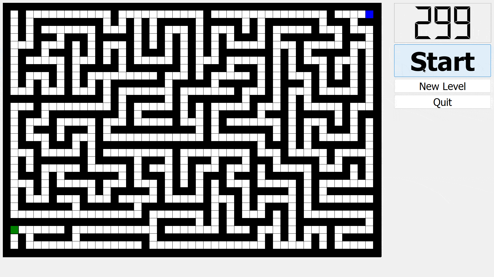
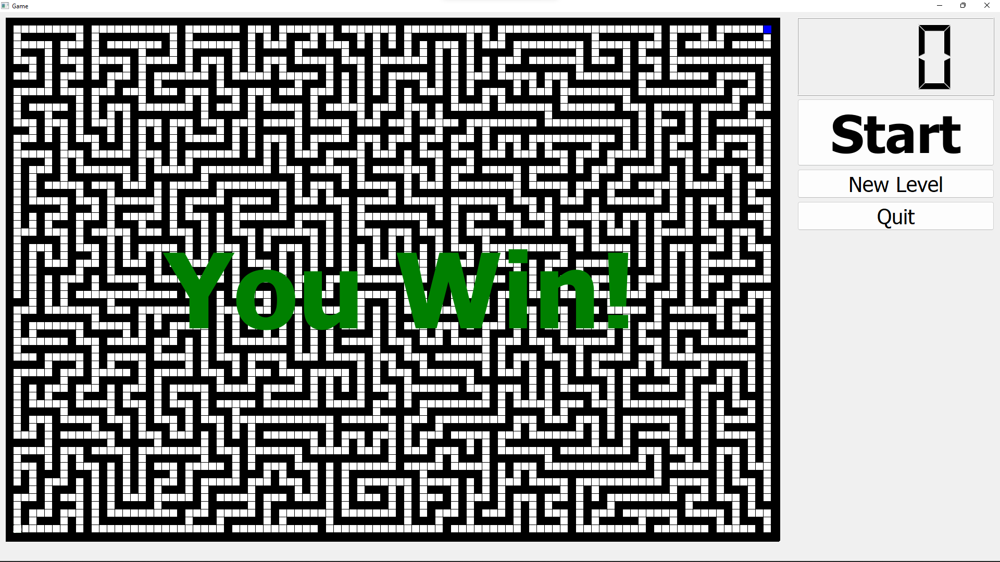
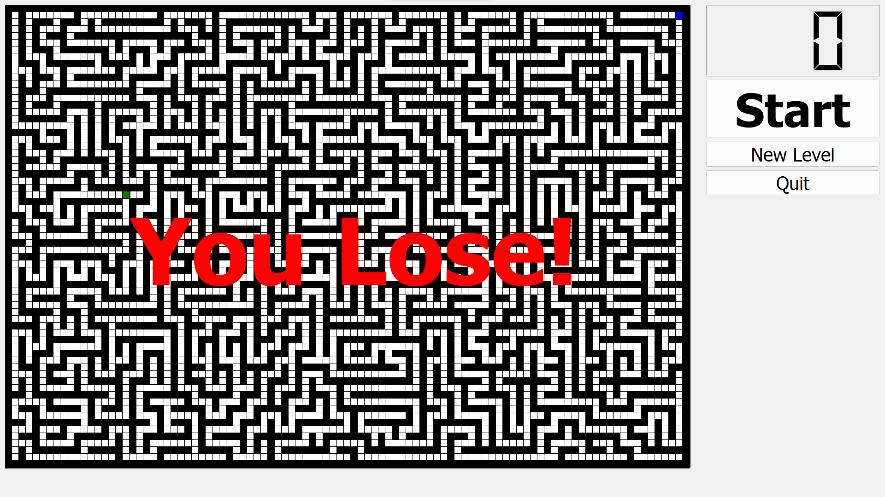

# Simle maze game using Qt
This is a university project. The main goal of this work is to implement a computer game "Maze" using Qt and C++.

## Description
In this project I have implemented a computer game "Maze". The essence of the "Maze" game is to find a way out. In the maze there are impassable walls and dead ends, which prevent to find the solution. To implement this game and organize the visual part, I have used Qt graphics library. This graphics library is a framework for developing cross-platform applications in C++. The maze is built on a rectangular playing field. Each cell of the maze can be one of two types: an empty cell and a wall. The goal of the game is to get to the finish line before time runs out.

## Usage
### 🎬 Starting the game:
When the program starts, a random maze is generated, but the player cannot move. When you press the `Start` button, the countdown starts and the control buttons: arrows and buttons `W` `A` `S` `D` start working.

### 🆕 New Maze Generation:
Regardless of whether the game is in progress or on hold (Player has not pressed Start), pressing the `New Level` button generates a new maze, the player returns to the starting position, the timer resets. It is expected that if the player likes the new maze, he can press `Start` and start the game, or once again press the `New Level` button to generate a new maze.

### 🏆 Winning conditions:
If a player reaches the finish line before time runs out, he wins, the game stops and displays message `You Win!`

### 😭 Losing conditions:
If the player runs out of time and does not reach the finish line, he loses, he game stops and displays message `You Lose!` 

## Technologies
 - ISO C++14 Standard
 - Qt build: Qt 5.12.12: MSVC 2017
 - Dev environment: Visual Studio 2019
